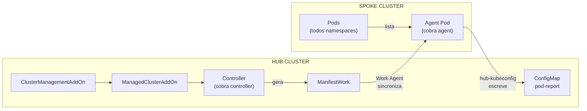

# addon-framework-basic

Addon OCM que coleta informações de pods dos managed clusters e reporta ao hub. Construído com addon-framework seguindo o padrão do helloworld_agent.

## Visão geral

O addon demonstra o fluxo completo com comunicação spoke→hub:

1. **Controller** no hub observa `ManagedClusterAddOn` e gera `ManifestWork`
2. **Agent** é deployado no spoke via ManifestWork
3. Agent coleta pods do spoke e envia **pod report** para o hub (ConfigMap)
4. Health prober monitora disponibilidade do deployment

**O que o agent faz:** Coleta todos os pods do spoke e cria/atualiza um ConfigMap `pod-report` no namespace do cluster no hub a cada 60 segundos.

## Desenvolvimento local

### Pré-requisitos

| Requisito | Descrição |
|-----------|-----------|
| Go | 1.24+ (confira no `go.mod`) |
| OCM Hub | Cluster com OCM instalado |
| Managed Cluster | Pelo menos um spoke registrado e aceito |
| Kubeconfig | Arquivos de acesso ao hub e spoke |

### Variáveis de ambiente

| Variável | Descrição | Padrão |
|----------|-----------|--------|
| `KUBECONFIG` | Kubeconfig do hub cluster | `~/.kube/config` |
| `ADDON_IMAGE` | Imagem do addon (controller + agent) | `basic-addon:latest` |
| `IMAGE` | Tag da imagem Docker (para make) | `basic-addon:latest` |
| `CLUSTER` | Nome do managed cluster | (obrigatório nos comandos) |

### Subindo o ambiente

```sh
# 1. Exportar kubeconfig do hub
export KUBECONFIG=~/.kube/local/platform-operator/config.hub

# 2. Aplicar RBAC e ClusterManagementAddOn no hub
make deploy-rbac

# 3. Rodar controller localmente
make run
```

### Habilitando o addon em um cluster

Em outro terminal:

```sh
export KUBECONFIG=~/.kube/local/platform-operator/config.hub

# Habilitar addon no cluster
make enable CLUSTER=<nome-do-managed-cluster>

# Verificar recursos criados
kubectl get managedclusteraddons -A
kubectl get manifestworks -A
```

### Verificando o agent no spoke

```sh
export KUBECONFIG=~/.kube/local/platform-operator/config.spoke1

# Verificar pod do agent
kubectl get pods -n open-cluster-management-agent-addon

# Ver logs do agent
kubectl logs -l app=basic-addon-agent -n open-cluster-management-agent-addon
```

### Verificando o pod report no hub

```sh
export KUBECONFIG=~/.kube/local/platform-operator/config.hub

# Ver ConfigMap com report de pods
make check-report CLUSTER=<nome-do-managed-cluster>

# Ou manualmente
kubectl get configmap pod-report -n <nome-do-managed-cluster> -o yaml
```

### Limpeza

```sh
export KUBECONFIG=~/.kube/local/platform-operator/config.hub

make disable CLUSTER=<nome-do-managed-cluster>
make undeploy
```

## Referência

### Makefile targets

| Target | O que faz |
|--------|-----------|
| `build` | Compila o binário (`bin/addon`) |
| `run` | Executa controller localmente |
| `test` | Executa testes unitários |
| `tidy` | Executa `go mod tidy` |
| `deploy-rbac` | Aplica RBAC + CMA no hub (para dev local) |
| `deploy` | Deploy completo (RBAC + controller pod) |
| `undeploy` | Remove todos os recursos do hub |
| `enable` | Habilita addon em um cluster (`CLUSTER=xxx`) |
| `disable` | Desabilita addon de um cluster (`CLUSTER=xxx`) |
| `check-report` | Exibe pod report de um cluster (`CLUSTER=xxx`) |
| `docker-build` | Constrói imagem Docker |
| `docker-push` | Publica imagem Docker |

### Estrutura do projeto

```
addon-framework-basic/
├── cmd/addon/
│   └── main.go                      # Entry point (cobra: controller + agent)
├── pkg/
│   ├── addon/
│   │   ├── addon.go                 # Factory functions
│   │   ├── addon_test.go            # Testes
│   │   └── manifests/templates/     # Templates do agent (spoke)
│   │       ├── deployment.yaml
│   │       ├── serviceaccount.yaml
│   │       └── clusterrolebinding.yaml
│   ├── agent/
│   │   ├── agent.go                 # Agent que coleta pods
│   │   └── agent_test.go
│   └── hub/
│       └── rbac.go                  # RBAC dinâmico no hub
├── deploy/                          # Recursos para deploy no hub
│   ├── serviceaccount.yaml
│   ├── clusterrole.yaml
│   ├── clusterrolebinding.yaml
│   ├── deployment.yaml
│   └── clustermanagementaddon.yaml
├── Dockerfile
├── Makefile
└── go.mod
```

## Distribuição

### Deploy em cluster remoto

1. Construa e publique a imagem:

   ```sh
   make docker-build IMAGE=<registro>/basic-addon:latest
   make docker-push IMAGE=<registro>/basic-addon:latest
   ```

2. Atualize a imagem em `deploy/deployment.yaml`:

   ```yaml
   image: <registro>/basic-addon:latest
   env:
     - name: ADDON_IMAGE
       value: "<registro>/basic-addon:latest"
   ```

3. Deploy no hub:

   ```sh
   make deploy
   ```

4. Habilite nos clusters desejados:

   ```sh
   make enable CLUSTER=cluster1
   make enable CLUSTER=cluster2
   ```

### Desinstalação

```sh
make disable CLUSTER=cluster1
make undeploy
```

## Arquitetura



## Pod Report

O agent envia um ConfigMap `pod-report` para o hub com a seguinte estrutura:

```json
{
  "clusterName": "spoke1",
  "timestamp": "2025-01-15T22:00:00Z",
  "totalPods": 42,
  "pods": [
    {
      "name": "nginx-xxx",
      "namespace": "default",
      "status": "Running",
      "nodeName": "node1"
    }
  ]
}
```

A estrutura `PodInfo` é extensível - adicione mais campos conforme necessário em `pkg/agent/agent.go`.

## Referências

- [OCM Addon Developer Guide](https://open-cluster-management.io/docs/developer-guides/addon/)
- [addon-framework repository](https://github.com/open-cluster-management-io/addon-framework)
- Exemplo helloworld_agent: `addon-framework/examples/helloworld_agent/`
