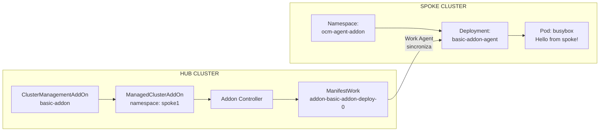

# addon-framework-basic

Addon OCM básico construído com addon-framework. Serve como template/scaffold para criar addons customizados que deployam agentes em managed clusters.

## Visão geral

O addon demonstra o fluxo completo do addon-framework:
1. Controller no hub observa `ManagedClusterAddOn`
2. Gera `ManifestWork` com os manifests do agent
3. Work agent no spoke aplica os manifests
4. Health prober monitora disponibilidade do deployment

**O que o agent faz:** Loga "Hello from spoke!" a cada 60 segundos (template para evoluir).

## Desenvolvimento local

### Pré-requisitos

| Requisito | Descrição |
|-----------|-----------|
| Go | Confira no `go.mod` |
| OCM Hub | Cluster com OCM instalado |
| Managed Cluster | Pelo menos um spoke registrado e aceito |
| Kubeconfig | Arquivos de acesso ao hub e spoke |

### Variáveis de ambiente

| Variável | Descrição | Padrão |
|----------|-----------|--------|
| `KUBECONFIG` | Kubeconfig do hub cluster | `~/.kube/config` |
| `IMAGE` | Tag da imagem Docker | `basic-addon:latest` |
| `CLUSTER` | Nome do managed cluster (para enable/disable) | (obrigatório nos comandos) |

### Subindo o ambiente

```sh
# 1. Exportar kubeconfig do hub
export KUBECONFIG=~/.kube/local/platform-operator/config.hub

# 2. Aplicar RBAC e ClusterManagementAddOn no hub
make deploy-rbac

# 3. Rodar controller localmente (como make run do Kubebuilder)
make run
```

### Habilitando o addon em um cluster

Em outro terminal:

```sh
export KUBECONFIG=~/.kube/local/platform-operator/config.hub

# Habilitar addon no cluster
make enable CLUSTER=<nome-do-managed-cluster>

# Verificar recursos criados
kubectl get managedclusteraddons -A
kubectl get manifestworks -A
```

### Verificando o agent no spoke

```sh
export KUBECONFIG=~/.kube/local/platform-operator/config.spoke1

# Verificar pod do agent
kubectl get pods -n open-cluster-management-agent-addon

# Ver logs do agent
kubectl logs -l app=basic-addon-agent -n open-cluster-management-agent-addon
```

### Limpeza

```sh
export KUBECONFIG=~/.kube/local/platform-operator/config.hub

make disable CLUSTER=<nome-do-managed-cluster>
make undeploy
```

## Referência

### Makefile targets principais

| Target | O que faz |
|--------|-----------|
| `build` | Compila o binário (`bin/addon`) |
| `run` | Executa controller localmente |
| `tidy` | Executa `go mod tidy` |
| `deploy-rbac` | Aplica RBAC + CMA no hub (para dev local) |
| `deploy` | Deploy completo (RBAC + controller pod) |
| `undeploy` | Remove todos os recursos do hub |
| `enable` | Habilita addon em um cluster (`CLUSTER=xxx`) |
| `disable` | Desabilita addon de um cluster (`CLUSTER=xxx`) |
| `docker-build` | Constrói imagem Docker |
| `docker-push` | Publica imagem Docker |

### Estrutura do projeto

```
addon-framework-basic/
├── cmd/addon/
│   ├── main.go                 # Controller (roda no hub)
│   └── manifests/
│       └── deployment.yaml     # Agent (deployado no spoke)
├── deploy/                     # Recursos para deploy no hub
│   ├── serviceaccount.yaml
│   ├── clusterrole.yaml
│   ├── clusterrolebinding.yaml
│   ├── deployment.yaml         # Controller pod (produção)
│   └── clustermanagementaddon.yaml
├── Dockerfile
├── Makefile
└── go.mod
```

## Distribuição

### Deploy em cluster remoto

1. Construa e publique a imagem:

   ```sh
   make docker-build IMAGE=<registro>/basic-addon:latest
   make docker-push IMAGE=<registro>/basic-addon:latest
   ```

2. Atualize a imagem em `deploy/deployment.yaml`:

   ```yaml
   image: <registro>/basic-addon:latest
   ```

3. Deploy no hub:

   ```sh
   make deploy
   ```

4. Habilite nos clusters desejados:

   ```sh
   make enable CLUSTER=cluster1
   make enable CLUSTER=cluster2
   ```

### Desinstalação

```sh
make disable CLUSTER=cluster1
make undeploy
```

## Arquitetura



## Referências

- [OCM Addon Developer Guide](https://open-cluster-management.io/docs/developer-guides/addon/)
- [addon-framework repository](https://github.com/open-cluster-management-io/addon-framework)
- Exemplo busybox: `addon-framework/cmd/example/busybox/`
