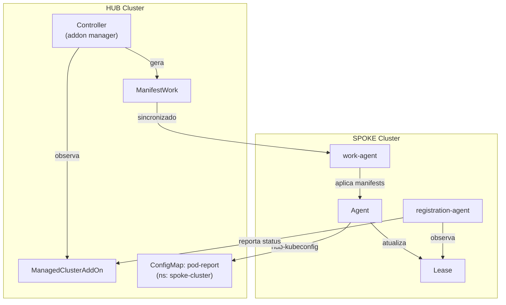

# basic-addon

Exemplo simples de addon OCM usando o addon-framework.

## O que faz

1. **Controller** roda no hub, observa `ManagedClusterAddOn` e gera `ManifestWork`
2. **Agent** é deployado nos spokes pelo work-agent que aplica o `ManifestWork`
3. Agent coleta info dos pods e escreve um ConfigMap `pod-report` no hub

## Estrutura do projeto

```
├── cmd/addon/main.go           # Entry point (comandos controller + agent)
├── pkg/
│   ├── addon/                  # Factory do addon (manifests, registration, health)
│   │   └── manifests/templates # Templates de deployment do agent
│   ├── agent/                  # Agent que roda nos spokes
│   └── hub/                    # RBAC do hub para permissões do agent
├── deploy/                     # Manifests de deployment no hub
├── Dockerfile
└── Makefile
```

## Quick start

```sh
# 1. Deploy no hub
kubectl apply -f deploy/

# 2. Rodar controller localmente (ou fazer deploy do pod)
make run

# 3. Habilitar addon em um cluster
make enable CLUSTER=<nome-do-cluster>

# 4. Verificar pod report
make check-report CLUSTER=<nome-do-cluster>
```

## Comandos do Makefile

| Comando | Descrição |
|---------|-----------|
| `build` | Compila o binário |
| `run` | Roda controller localmente |
| `test` | Roda testes |
| `docker-build` | Constrói imagem docker |
| `deploy` | Deploy no hub |
| `undeploy` | Remove do hub |
| `enable CLUSTER=x` | Habilita addon no cluster |
| `disable CLUSTER=x` | Desabilita addon no cluster |
| `check-report CLUSTER=x` | Exibe pod report |

## Arquitetura



## Referências

- [OCM Addon Developer Guide](https://open-cluster-management.io/docs/developer-guides/addon/)
- [addon-framework](https://github.com/open-cluster-management-io/addon-framework)
